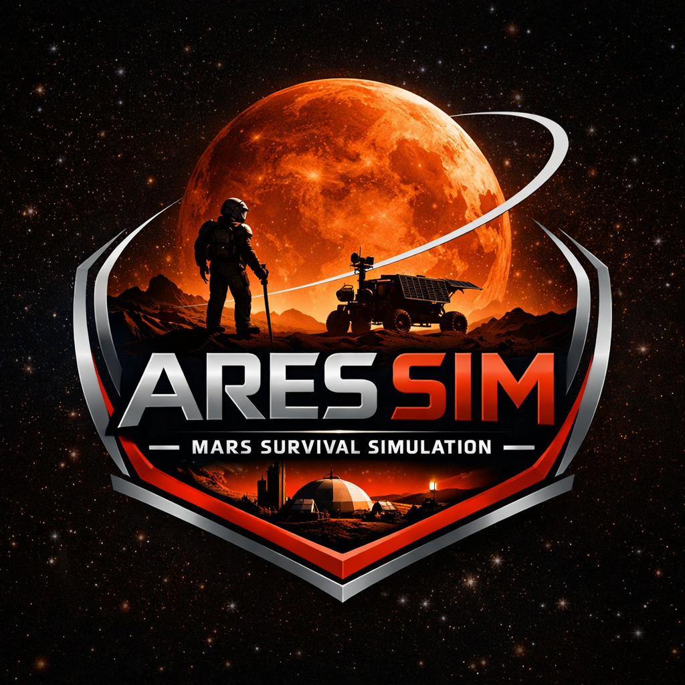

<p align="center">
  
</p>

<h1 align="center">AresSim</h1>

<video controls>
  <source src="./assets/demo.mp4" type="video/mp4">
</video>

<p align="center">
  <strong>Mars Survival RL Environment</strong><br>
  A high-fidelity grid-world simulation for training human agents in extreme extraterrestrial conditions
</p>

<p align="center">
  <a href="./LICENSE"></a>
  
</p>

---

> ⚠️ **Work In Progress**: This project currently provides a **visualization UI only**. RL training integration with frameworks like Stable Baselines3, RLlib, or custom implementations is planned for future releases. Stay tuned!

---

## 📋 Table of Contents

- [Overview](#-overview)
- [Features](#-features)
- [The Mission Map](#-the-mission-map-geospatial-grid)
- [Agent Vitals](#-agent-vitals-state-vector)
- [Survival Mechanics](#-survival-mechanics--operational-rules)
- [Movement & Energy](#-movement--energy-costs)
- [Environmental Telemetry](#-environmental-telemetry-the-sol-cycle)
- [Reward Function](#-reward-function-rl-optimization)
- [Installation](#-installation)
- [Usage](#-usage)
- [Tech Stack](#-tech-stack)
- [Roadmap](#-roadmap)
- [Contributing](#-contributing)
- [License](#-license)

---

## 🚀 Overview

**AresSim** is a sophisticated Mars survival simulation environment designed for reinforcement learning research and development. It provides a challenging testbed where autonomous agents must navigate treacherous Martian terrain, manage limited resources, and survive against extreme environmental hazards.

The environment simulates:
- **Varied terrain types** with different traversal costs
- **Resource management** (energy, oxygen, health)
- **Dynamic environmental conditions** (temperature, radiation, dust storms)
- **Rich observation space** for state-based decision making
- **Carefully designed reward signals** for RL optimization

---

## ✨ Features

| Feature | Description |
|---------|-------------|
| **15x15 Grid World** | Localized sector of the Martian surface with diverse terrain |
| **Dynamic Environment** | Sol cycle with changing temperature, radiation, and weather |
| **Resource Management** | Oxygen, energy, and health systems with depletion mechanics |
| **Hazard System** | Craters, dust storms, extreme cold, and radiation exposure |
| **Reward Shaping** | Carefully designed rewards for survival and exploration |
| **Real-time Visualization** | Interactive dashboard for monitoring agent behavior |

---

## 🗺️ The Mission Map (Geospatial Grid)

The environment is a **15x15 Grid World** representing a localized sector of the Martian surface. Each coordinate contains a specific terrain type:

| Terrain | Description | Movement Cost |
|---------|-------------|---------------|
| **BASE** (Station Alpha) | Central hub for recharging. Only location for Recharge Pack use. | 1.0 |
| **FLAT** (Regolith Plains) | Optimized terrain with lowest resistance | 1.0 |
| **SANDY** (Dune Fields) | Loose soil causing wheel slippage | 2.0 |
| **ROCKY** (Hesperian Chaos) | Large debris, punishing on mechanics | 3.0 |
| **CRATER** (No-Go Zone) | High-risk zones with 50% damage probability | 2.0 + Risk |
| **ICE** (Subsurface Deposits) | Rare frozen water deposits for mining | 1.0 |

---

## 🤖 Agent Vitals (State Vector)

The agent's survival is governed by four primary metrics:

```
┌──────────────────────────────────────────────────────┐
│  VITAL SIGNS                                          │
├──────────────────────────────────────────────────────┤
│  Health (0-100%)   → Structural integrity         │
│  Energy (0-100%)   → Battery level (-0.1/tick)    │
│  Oxygen (0-100%)   → Life support (-0.5/tick)     │
│  Body Temp        → Internal thermal regulation  │
└──────────────────────────────────────────────────────┘
```

> **Critical**: If Health reaches **0**, the mission is terminated (**Signal Lost**).

---

## ⚙️ Survival Mechanics & Operational Rules

### Depletion Penalties
| Condition | Penalty |
|-----------|---------|
| Oxygen = 0 | **-5 Health/tick** |
| Energy = 0 | **-5 Health/tick** |
| Both Depleted | **-10 Health/tick** (stacked) |

### Consumable Stabilization
| Item | Effect |
|------|--------|
| **Oxygen Tank** | +50 Oxygen, **resets Health to 100%** |
| **Recharge Pack** | +50 Energy (BASE only), **resets Health to 100%** |

### Environmental Hazards

| Hazard | Condition | Effect |
|--------|-----------|--------|
| **Extreme Cold** | Temp < -70°C AND Energy < 10 | -1 Health/tick |
| **Dust Storms** | Intensity > 0.8 | -1 Health/tick |
| **Elevated Radiation** | > 5.0 mSv | -0.5 Health/tick |
| **Dangerous Radiation** | > 8.0 mSv | -2.5 Health/tick |

---

## 🚶 Movement & Energy Costs

The agent can move in four cardinal directions (North, South, East, West):

| Terrain Type | Energy Cost | Reward Impact |
|--------------|-------------|---------------|
| **Flat** | 1.0 | -1.0 |
| **Sandy** | 2.0 | -2.0 |
| **Rocky** | 3.0 | -3.0 |
| **Crater** | 2.0 + Damage Risk | -10.0 |

---

## 🌌 Environmental Telemetry (The "Sol" Cycle)

The environment simulates the harsh Martian day/night cycle:

| Metric | Details |
|--------|---------|
| **Temporal Flow** | 0.5 hours per tick (800ms). Full Sol = 24 hours |
| **Temperature** | Day: ~20°C → Night: ~-80°C |
| **Dust Storms** | Random events, intensity 0.0–1.0 |
| **Radiation** | Background 0.0–10.0 mSv fluctuation |

---

## 🎯 Reward Function (RL Optimization)

The agent is motivated by a scalar reward signal:

| Event | Reward |
|-------|--------|
| **Survival Bonus** | +0.1 / tick |
| **Ice Mining** | +50.0 |
| **Consumable Use** | +10.0 |
| **Movement (Flat)** | -1.0 |
| **Movement (Sandy)** | -2.0 |
| **Movement (Rocky)** | -3.0 |
| **Crater Entry** | -10.0 |
| **Mission Failure** | -100.0 |

---

## 📦 Installation

### Prerequisites

- **Node.js** 18+ 
- **Python** 3.9+ (for RL training)
- **npm** or **yarn**

### Setup

```bash
# Clone the repository
git clone https://github.com/yourusername/AresSim.git
cd AresSim

# Install React UI dependencies
npm install

# Install Python environment (for RL training)
pip install -e ".[train]"

# Start the development server
npm run dev
```

The visualization dashboard will be available at `http://localhost:5173`

---

## 🎮 Usage

### Running the Visualizer (Local Mode)

```bash
npm run dev
```

This launches the real-time dashboard where you can:
- View the 15x15 Mars terrain grid
- Monitor agent vitals (Health, Energy, Oxygen)
- Track environmental conditions
- Review event logs
- Observe cumulative rewards

### Controls

| Action | Description |
|--------|-------------|
| **Arrow Keys / WASD** | Move agent (N/S/E/W) |
| **Play/Pause** | Toggle simulation |
| **Use O2** | Consume oxygen tank |
| **Recharge** | Use recharge pack (at BASE) |
| **Mine Ice** | Extract ice at ICE tiles |

---

## 🤖 RL Training

### Quick Start

```bash
# Train a PPO agent (headless, fast)
python scripts/train.py --total-timesteps 100000

# Monitor training with TensorBoard
tensorboard --logdir logs/
```

### Visualize Trained Agent

```bash
# Start the Python environment server
python scripts/run_with_viz.py models/mars_ppo_*/final_model.zip

# In another terminal, start the React UI
npm run dev
```

Then switch to **Remote** mode in the UI header to connect.

### Using as a Gymnasium Environment

```python
import gymnasium as gym
import gym_mars  # Auto-registers the environment

env = gym.make("gym_mars/MarsSurvival-v0")
obs, info = env.reset()

for _ in range(1000):
    action = env.action_space.sample()  # Replace with your policy
    obs, reward, terminated, truncated, info = env.step(action)
    
    if terminated or truncated:
        obs, info = env.reset()

env.close()
```

### Action Space

| Action ID | Name |
|-----------|------|
| 0 | Move North |
| 1 | Move South |
| 2 | Move East |
| 3 | Move West |
| 4 | Mine Ice |
| 5 | Use Oxygen Tank |
| 6 | Charge Battery |

---

## 🛠️ Tech Stack

| Technology | Purpose |
|------------|---------|
| **React 19** | UI Framework |
| **TypeScript** | Type-safe development |
| **Vite** | Build tool & dev server |
| **Recharts** | Data visualization |
| **Lucide React** | Icon library |
| **Gymnasium** | RL environment API |
| **Stable Baselines3** | RL training algorithms |
| **WebSocket** | Real-time Python ↔ UI bridge |

---

## 🗺️ Roadmap

- [x] Core simulation mechanics
- [x] Real-time visualization dashboard
- [x] **Gymnasium/Gym API integration**
- [x] **Python bindings via WebSocket**
- [ ] Curriculum learning presets
- [ ] Multi-agent support
- [ ] Model zoo with pretrained agents

---

## 🤝 Contributing

Contributions are welcome! Here's how you can help:

1. **Fork** the repository
2. **Create** a feature branch (`git checkout -b feature/amazing-feature`)
3. **Commit** your changes (`git commit -m 'Add amazing feature'`)
4. **Push** to the branch (`git push origin feature/amazing-feature`)
5. **Open** a Pull Request

Please ensure your code follows the existing style and includes appropriate tests.

---

## 📄 License

This project is licensed under the **MIT License** - see the [LICENSE](./LICENSE) file for details.

---

## 🙏 Acknowledgments

- Inspired by Mars exploration missions and the challenges of autonomous rover operations
- Built for the reinforcement learning research community

---

<p align="center">
  <strong>Survive. Adapt. Explore.</strong>
</p>

<p align="center">
  Made with ❤️ by <a href="https://github.com/shanmukh">Shanmukh</a> for the RL community
</p>
