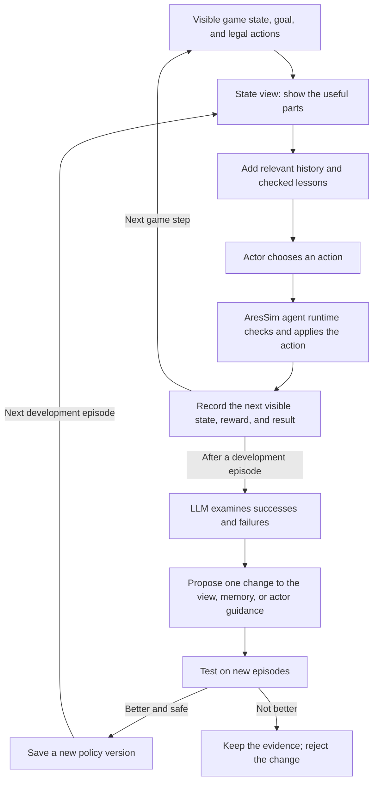

# Experience-Driven Agent Learning Plan

Status: proposed research and implementation plan. The LLM agent described here is not implemented yet.

For the short goal statement, see [Objective](objective.md). The [component research plan](component_research_plan.md) sets out what to study before choosing memory and other mechanisms; the [literature review](literature_survey.md) records the evidence. The [Jev workflow](../../engine/aresim/algorithms/jev/workflow.md) describes the existing decision-model agent.

## 1. What we want to build

We want an agent that gets better by using what happened in earlier games. We will begin with AresSim and later test the same learning approach in other simulation games.

The central idea is to use an LLM as a **slow learner** and a smaller or simpler model as a **fast actor**:

- The LLM studies completed episodes. It proposes what the actor should see, what past experience is worth remembering, and what guidance might improve its decisions.
- A fast actor chooses actions during the game. It might be Jev, Laya, or a simple controller. We will also test an LLM that acts directly.
- The simulator checks every action. It, not the LLM, decides which actions are legal and what reward the agent receives.

The LLM is allowed to propose changes, but a proposal is **not** accepted because it sounds convincing. It must improve results in new episodes. This is the main research question: *Can an LLM turn gameplay experience into a better state view and better decision guidance, at a worthwhile cost?*

For the first study, no model weights change. The system learns by changing small, versioned pieces of information and configuration. Training a decision model can be a separate future study.

## 2. The full workflow

A **policy version** fixes the state view, long-term lessons, actor settings, prompts, and provider/model details used for one episode. The actor may update its short-term memory as the episode unfolds, but the long-term lessons and rules do not change halfway through that episode. This makes it possible to tell which version produced each result.

The current AresSim agent interface gives an agent the observation and action mask when it acts. This plan also needs a small **post-step feedback hook**: after an action, the LLM workflow must receive the next actor-visible observation, permitted reward/events, and whether the episode ended. Without that, it cannot reliably connect a decision to its outcome. The acting agent never receives hidden simulator state.

## 3. Let the LLM choose how to preprocess state

Preprocessing is more than making JSON shorter. It decides which facts the actor can use. If it removes a battery warning or treats an unseen cell as empty, even a good decision model will fail.

We will separate three things:

1. **Game adapter:** trusted code exposes only the observation, goal, and legal actions available to an ordinary agent. In AresSim this starts from `aresim.obs.local.v1`, not the full `WorldState` or UI snapshot. Each new game needs an adapter; visual games also need a way to turn images into usable observations.
2. **State view:** the LLM proposes which visible fields and derived facts to show the actor. For example, it might show battery level, cargo, current goal, nearby resources, and recent battery change instead of every cell in an 8×8 crop. The host executes this view in a repeatable way.
3. **Optional detail requests:** if a compact view is not enough, the actor may ask a bounded read-only question about the *same* visible state. We will test whether this is worth the extra time and cost.

The LLM may choose from safe operations such as selecting fields, calculating a change over time, ranking visible cells, or summarizing a local area. It cannot run arbitrary code during gameplay, read hidden fields, or invent observations. Each proposed view is saved with a version, its source fields, and a size limit. Unknown information must stay marked as unknown.

We will compare four starting choices with the **same actor and memory**: a full readable observation, a compact view written by us, an LLM-selected subset of fields, and an LLM-designed view using the allowed operations. A view is useful only if it helps decisions on new episodes after its creation and inference costs are counted. Fewer tokens alone are not enough.

## 4. Keep useful experience, not just more text

Every development episode produces a raw record: what the agent could see, what it was told, its legal choices, the action it proposed, the action actually taken, the next visible observation, and the result. These records are never rewritten.

Between episodes, the LLM may turn several records into a short lesson or subgoal. For example: “When colony power margin is positive, waiting may recharge the rover; check this before choosing Wait.” The lesson must link to the episodes that support it and keep any counterexamples. It is tested on different development episodes before it can guide the actor. If later evidence contradicts it, narrow or retire it.

The actor receives a small **decision packet**, not the whole archive. It contains the current goal, selected state view, relevant recent changes, a few applicable lessons, and the legal actions. The packet has a fixed size limit. We will compare it with no cross-episode memory, raw recent history, and ordinary LLM summaries at the same context budget.

We may ask the LLM to predict selected action outcomes during an audit, then compare those predictions with what actually happened. This helps test whether it learned a real pattern. A prediction is not required on every game step, and prediction accuracy is not a substitute for better gameplay.

## 5. Choose the actor by measured results

The first actor comparisons are:

| Actor | Why test it? |
|---|---|
| Scripted controller | Fast, transparent baseline and fallback |
| Existing Jev agent | Current AresSim decision-model baseline |
| Jev using the new decision packet | Tests whether LLM-learned guidance improves the same kind of decision model |
| Laya using the same packet | Tests a local, typed decision model; this integration does not yet exist in AresSim |
| Direct LLM | Shows what we gain or lose by letting an LLM choose every action |

The existing `jev/` implementation stays unchanged. New Jev/Laya packet adapters belong under `engine/aresim/algorithms/llm/`. Give them the same legal choices and packet where possible. If a fast actor faces a situation outside its tested scope, the host may ask an LLM for one bounded decision; otherwise it uses a safe legal fallback. This escalation is part of the policy and must be counted in its cost and latency.

“Fast” means end-to-end time, not only model inference time. Hosted Jev may have network delay; local Laya has hardware and setup costs. We will measure both. We will also report how many episodes it would take for cheaper acting to repay the up-front cost of LLM learning.

## 6. How the system improves

The first learning loop should be simple and easy to audit:

1. Run development episodes with a fixed policy version and record all outcomes and costs.
2. Find a repeated, costly failure. Decide whether the actor lacked information, retrieved bad history, or chose poorly despite having the right information.
3. Ask the LLM to propose **one small change** to the state view, memory/lessons, or decision packet. It must name the evidence and the improvement it expects.
4. Reject changes that use hidden data, break the observation contract, exceed budgets, or omit required goal/legal-action information.
5. Screen the surviving change on recorded decisions, then test it in **new, paired episodes**. A recorded trajectory cannot tell us what would have happened if the new policy had chosen different actions.
6. Keep the change only if it meets predeclared quality, safety, latency, and cost requirements. Record rejected ideas and failures too.

Change one part at a time at first. If the state view, memory, and actor all change together, we cannot tell what helped. After the individual parts are understood, test useful combinations. A simple, fixed experiment scheduler should choose tests and enforce the budget; the LLM proposes ideas but does not grade itself.

The first experiment should isolate **state preprocessing**: use one goal-bearing AresSim task, one fixed actor, no cross-episode lessons, and the four state-view choices from Section 3. Next, hold the best view fixed and test memory. Only then compare actors and providers. A strong scripted policy is a valid outcome; complexity must earn its place.

## 7. Test whether it generalizes

Different claims need different tests:

| Test | What changes? | What it tells us |
|---|---|---|
| New AresSim seeds | Map, weather, resources, starting position | Whether the agent learned more than one episode |
| Changed AresSim tasks | Goal, reward priorities, or game settings | Whether its guidance adapts within one game |
| Related games | Some mechanics or concepts overlap | Whether knowledge and the learning method transfer |
| Different games | Observation type, actions, and rules change | Whether the *method* transfers, not whether a rover tactic does |

For a new game, compare three conditions: use the AresSim-learned system immediately; let it learn for a fixed number of target-game episodes; and start the same learner from scratch with that same budget. Call the first result **zero-shot** and the second **adaptation**. Do not treat them as the same claim. Each game needs a thin adapter for its public observation, goal, legal actions, and feedback. Record how much human work that adapter took; it must not hide a hand-written game strategy.

Possible later testbeds include [ALFWorld](https://arxiv.org/abs/2010.03768), [ScienceWorld](https://arxiv.org/abs/2203.07540), [Crafter](https://arxiv.org/abs/2109.06780), and [Procgen](https://arxiv.org/abs/1912.01588). These are candidates, not promised integrations. Choose them after checking their interfaces and evaluation cost. AresSim alone can establish new-seed performance, but not a claim of generality across games.

Keep separate development, lesson-check, policy-selection, and final test sets. The final test is used only after choosing a policy. Compare methods on matched tasks and seeds, and report success or progress, safety failures, worst-case outcomes, action loops, total cost, and decision latency. For provider comparisons, give OpenAI, Anthropic, Gemini, and OpenRouter the same starting evidence, keep their learned policy versions separate, and compare both outcomes **and** decisions in the same recorded situations. This lets us see whether the models learned similar or different policies.

## 8. Build boundaries and implementation order

All substantive LLM-agent work belongs in `engine/aresim/algorithms/llm/`: provider adapters, state views, memory, decision packets, actor adapters, traces, and the experiment loop. Only small registration, feedback, CLI, dependency, and UI connections should be outside that folder. In particular, do not change the existing Jev agent just to make the new workflow work.

OpenAI, Anthropic, Gemini, and OpenRouter should use one common LLM interface. Keep API keys on the server; record the exact provider/model and usage for every run. A fake provider is needed for tests that make no paid calls. Gameplay agents may inspect only permitted visible information. They cannot access shell, Git, arbitrary files or network services, hidden state, reward code, or test results. The host checks legal actions, timeouts, budgets, stale responses, and fallbacks.

The UI should let a user select a provider, actor, and saved policy version, while clearly disabling unavailable options. During a run it should show the selected state view, short-term goal, retrieved lesson IDs, chosen action, fallback or escalation, latency, and cost. An experiment view should show which changes were tested and accepted or rejected. The UI displays results; it does not contain the learning algorithm or API keys.

Store each run as an immutable experiment record: policy version, view and memory versions, code/environment versions, seeds, actions and outcomes, provider usage, costs, and promotion decision. This is the evidence needed to reproduce a result and to compare models fairly.

Most improvements should change a saved state view, lesson, or decision packet—not source code. If a later experiment needs a new mechanism, test that code change in a separate branch or worktree. Automated edits may touch only `engine/aresim/algorithms/llm/`; run tests and review the exact diff before using it in an experiment. A gameplay agent never edits its own code.

| Phase | Deliverable |
|---|---|
| 0. Contracts | Feedback hook, action validation, traces, full/compact views, and fake-provider episode tests |
| 1. Baselines | Direct LLM support for all four providers, scripted/Jev comparisons, and basic UI controls |
| 2. State views | LLM-proposed safe views and matched-seed tests against full and handcrafted views |
| 3. Learning and actors | Checked lessons, decision packets, Jev/Laya packet adapters, and cost-aware escalation |
| 4. Transfer | New-game adapters and zero-shot/adaptation/from-scratch comparisons |
| 5. Optional research | Add active branching, prompt search, Dream-RSI, or a swarm only if a simpler approach leaves a measured gap |

## 9. What we will not assume

Dream-RSI might later help decide **which experiment to run next**. It does not tell a rover which action is best, and replaying past traces cannot reveal the results of actions never taken. Brain-inspired memory is a useful way to think about raw experiences and learned lessons, but it is not proof that this design will work. A swarm or an automatically edited codebase is also not part of the first agent.

The important failure cases are clear: the LLM's view removes needed information; lessons are wrong or do not apply in new situations; a fast actor cannot use the packet; performance gains disappear on new seeds; or the learning cost is greater than the benefit. If that happens, keep the useful part and narrow the claim. The goal is a reliable learning method, not a collection of impressive-sounding components.

Before live experiments, we still need to choose the first goal-bearing AresSim task, a spending and latency limit, and the final test split. The choice of later games can wait until the AresSim learning loop has been measured.
