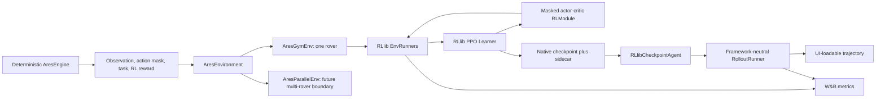
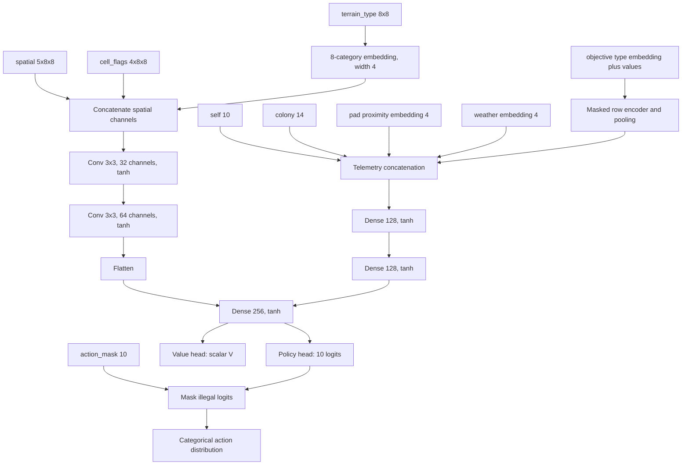
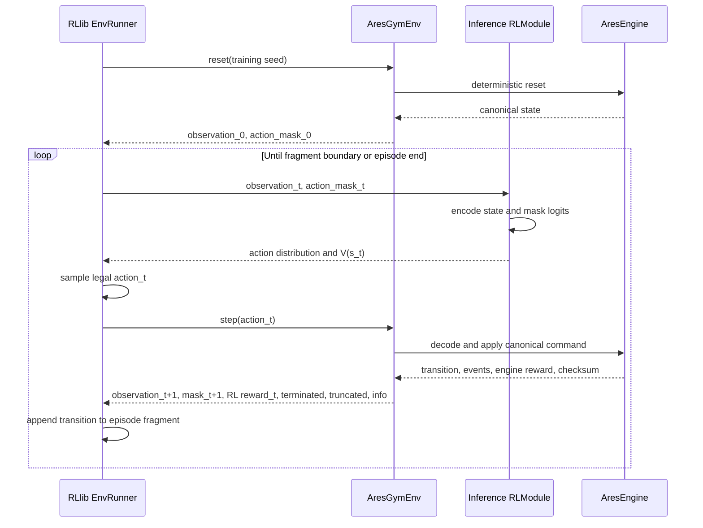
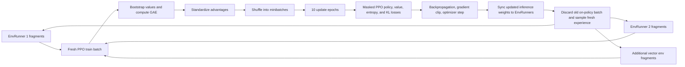
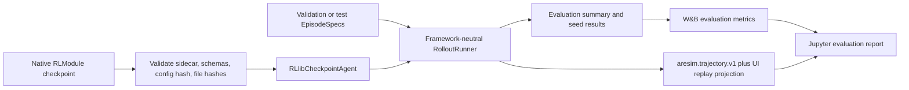

# AresSim RL Algorithms: Implementation, Training, and Evaluation

Last updated: 2026-08-31

This is the canonical guide to the reinforcement-learning implementation in AresSim. It explains the implemented policies, action-masked PPO, neural network, online trajectory sampling, learner updates, evaluation, metrics, checkpoints, and extension surface.

The current `phase1_open_exploration_v1` task has no victory condition. Reward, survival, exploration, legality, safety, and resource behavior are diagnostics—not evidence of mission completion or grounds for promoting a scientifically “best” checkpoint.

## Current implementation status

| Policy | Learning | Uses action mask | State | Purpose |
|---|---:|---:|---|---|
| Wait | No | Verifies Wait is legal | Implemented | Passive-survival and time-cost baseline |
| Uniform random | No | No; may select illegal actions | Implemented | Invalid-action and environment robustness baseline |
| Random-valid | No | Yes | Implemented | Untrained legal-action baseline |
| Scripted | No | Yes | Implemented | Deterministic partial-observation heuristic baseline |
| Action-masked PPO | Yes, on-policy | Yes, in exploration, training, and inference | Implemented | First learned reference policy |
| DQN, recurrent PPO, multi-agent policies | — | — | Planned | Later milestones; see the [Algorithm Literature Survey](algorithm_literature_survey.md) |

Only action-masked PPO is currently a learned RL algorithm. The other implemented policies are baselines: they are important comparisons and pipeline tests, but they do not optimize network parameters.

## Install and run

The base backend does not import numerical or training packages. From the repository root:

```bash
python3 -m venv engine/.venv
engine/.venv/bin/pip install -e './engine[dev,rllib,notebook]'
```

The `rllib` extra installs the environment dependencies, Ray with RLlib/Tune, PyTorch, W&B, YAML, plotting, and notebook support. Exact installed versions are recorded in each run manifest.

Checked-in experiment configurations are:

- [`configs/masked_ppo/smoke.yaml`](../../configs/masked_ppo/smoke.yaml): 4,096 environment steps;
- [`configs/masked_ppo/dev.yaml`](../../configs/masked_ppo/dev.yaml): 102,400 steps;
- [`configs/masked_ppo/reference.yaml`](../../configs/masked_ppo/reference.yaml): 1,048,576 steps.

```bash
engine/.venv/bin/aresim-rl train configs/masked_ppo/smoke.yaml
engine/.venv/bin/aresim-rl train configs/masked_ppo/dev.yaml \
  --set algorithm_config.learning_rate=0.0001 \
  --set resources.num_env_runners=2
```

Unknown YAML fields, unsafe tags, invalid values, incompatible batch sizes, missing seed manifests, unavailable GPUs, and existing run IDs fail before workers start.

## System ownership

The deterministic simulator remains the source of truth. RLlib changes how experience is collected and optimized; it does not own gameplay semantics.



- The engine owns transitions, legality, terminal failures, engine/UI reward, events, and checksums.
- Environment components own the policy observation, authoritative mask, selected RL reward, and task outcome.
- RLlib EnvRunners own online interaction and temporary episode fragments.
- RLlib Learners own GAE, PPO losses, minibatches, gradients, and optimizer state.
- Ray Tune owns trial lifecycle, resources, and checkpoint scheduling.
- AresSim owns validated experiment configuration, deterministic seeds, checkpoint provenance, frozen evaluation, trajectories, canonical W&B names, and local training report plots.

Adapters never inspect hidden state, recalculate rewards, rebuild masks, render, or serialize UI snapshots in the training hot loop.

## Policy input and action contract

`AresGymEnv` exposes one `rover_0` policy input:

```text
Dict({
  "observation": aresim.obs.local.v1,
  "action_mask": int8[10]
})
```

The local observation contains:

- `terrain_type uint8[8,8]`;
- `spatial float32[5,8,8]` for height, roughness, ice, ore, and dust;
- `cell_flags uint8[4,8,8]` for known, visible, scanned, and extracted;
- rover `self[10]` and colony `colony[14]` telemetry;
- categorical pad proximity and weather;
- fixed-capacity objective fields.

The rover is anchored at local index `[3,3]`; the crop covers world offsets `-3..+4` and is zero-padded without shifting at map edges. Open exploration has no objectives, so its objective tensors remain zero-padded.

Action IDs are stable:

| ID | Action | ID | Action |
|---:|---|---:|---|
| 0 | Wait | 5 | Scan current cell |
| 1 | Move north | 6 | Extract current cell |
| 2 | Move east | 7 | Build |
| 3 | Move south | 8 | Service |
| 4 | Move west | 9 | Unload |

The mask is computed by the environment from canonical validation rules. Wait is always legal. The neural network does not learn or duplicate those rules.

## Implemented baseline policies

The baselines live in [`engine/aresim/algorithms/baselines/`](../../engine/aresim/algorithms/baselines/) (`random.py`, `random_valid.py`, `scripted.py`, `wait.py`) and implement the same public `Agent` contract used by checkpoint policies.

### Wait

Wait always returns action `0` after asserting that its mask entry is legal. It measures passive resource decay, survival, reward time cost, and external truncation without navigation decisions.

### Uniform random

Uniform random samples all ten action IDs with equal probability. It deliberately ignores mask values and can select illegal actions. This makes it useful for checking invalid-action handling and for quantifying how much legality alone improves a policy.

### Random-valid

Random-valid samples uniformly from indices whose mask value is one. It has no observation-dependent strategy, but it never knowingly violates the current mask. It is the cleanest untrained comparison for masked PPO.

### Scripted

The scripted policy reads only `aresim.obs.local.v1`, the action mask, and resettable private navigation memory. Its priorities are:

1. unload carried cargo on the pad;
2. service when needed and legal;
3. continue legal build progress;
4. recharge on the pad below 80% battery;
5. return toward its remembered pad below 35% battery, at 75% payload, or when service is needed;
6. extract current-cell ice or scan current-cell rock;
7. navigate toward visible ice or unscanned rock;
8. explore in deterministic heading order, avoiding immediate backtracking;
9. Wait as the final fallback.

It is a fair partial-observation heuristic, not an oracle and not a network-training algorithm.

## Action-masked PPO

### How PPO works

Proximal Policy Optimization is an on-policy actor-critic algorithm. It alternates between:

1. sampling fresh transitions using the current policy;
2. estimating which sampled actions performed better or worse than the value baseline;
3. applying several minibatch gradient passes to those samples;
4. discarding the batch and sampling again with the updated policy.

PPO uses a clipped surrogate objective to prevent one update from changing action probabilities too aggressively. AresSim follows the clipped PPO design from [Schulman et al., *Proximal Policy Optimization Algorithms*](https://arxiv.org/abs/1707.06347), with Generalized Advantage Estimation from [Schulman et al., *High-Dimensional Continuous Control Using Generalized Advantage Estimation*](https://arxiv.org/abs/1506.02438).

For a sampled transition, the temporal-difference residual is conceptually:

```text
delta_t = reward_t + gamma * bootstrap_t * V(s_{t+1}) - V(s_t)
```

GAE combines future residuals using `gamma * lambda`:

```text
advantage_t = delta_t + gamma*lambda*delta_{t+1} + ...
```

RLlib standardizes the computed advantages before optimization. The PPO probability ratio compares the updated policy with the behavior policy that sampled the action:

```text
ratio_t = new_probability(action_t | state_t) / old_probability(action_t | state_t)
```

The policy objective takes the smaller of the ordinary and clipped improvement:

```text
min(
  ratio_t * advantage_t,
  clip(ratio_t, 1 - 0.2, 1 + 0.2) * advantage_t
)
```

With the pinned RLlib PPO defaults, the learner combines policy loss, value loss, entropy regularization, and adaptive KL control. Gradient norm is clipped at `0.5`.

### Why masking is part of the policy

Before constructing the categorical distribution, the model replaces every illegal action logit with the minimum representable finite value. Its softmax probability is therefore effectively zero. The same operation runs during exploration, learner forward passes, and deterministic inference.

```text
masked_logit[a] = raw_logit[a]             if action_mask[a] == 1
masked_logit[a] = minimum_finite_float     if action_mask[a] == 0
```

This ensures that both the behavior distribution stored during sampling and the updated distribution used by PPO share the same state-dependent legal set. The approach follows the policy-gradient justification studied by [Huang and Ontañón, *A Closer Look at Invalid Action Masking in Policy Gradient Algorithms*](https://arxiv.org/abs/2006.14171).

## Neural network implementation

The built-in `local_cnn_actor_critic` is implemented in [`train.py`](../../engine/aresim/algorithms/ppo/train.py) and selected through [`algorithms/registry.py`](../../engine/aresim/algorithms/registry.py).



Terrain and objective embeddings default to width `4`; convolution channels are `(32, 64)`; telemetry layers are `(128, 128)`; and the fused representation is `256`. Linear and convolution weights use orthogonal initialization. Policy and value heads are separate, while the feature encoder is shared.

The model consumes no `WorldState`, browser snapshot, remaining episode time, or privileged global map.

## How training trajectories are sampled

### Important terminology

| Term | Meaning in this pipeline |
|---|---|
| Transition | One `(observation, mask, action, reward, end flags, next observation)` interaction |
| Episode | Transitions from reset until authoritative termination or external truncation |
| Episode fragment | A contiguous portion of an episode emitted for batching; it may end before the episode does |
| Train batch | Fresh fragments combined until the learner has its configured number of environment transitions |
| Minibatch | A smaller shuffled slice used for one optimizer pass |
| Recorded trajectory | A validated evaluation artifact written by `TrajectoryWriter`; not PPO’s online replay memory |

### One environment interaction



For each step, RLlib retains the inputs and outputs needed by PPO: observation and mask, sampled action, behavior-policy logits/log-probability, selected RL reward, termination/truncation flags, value prediction, and episode boundary metadata. Environment `info` also feeds AresSim’s metrics callback, but it is not used to reconstruct simulator rules.

### From fragments to a learner update



The default train batch contains `4,096` environment transitions. With minibatches of `256`, one local learner performs `16` minibatch passes per epoch and `160` passes across ten epochs before the batch is discarded. This is repeated until `total_environment_steps` is reached.

`rollout_fragment_length="auto"` lets RLlib choose fragment sizes that satisfy the train batch. `batch_mode="truncate_episodes"` allows a fragment boundary inside an unfinished episode; it does not tell the environment that the episode ended.

### Termination versus truncation

- `terminated=True` means an authoritative simulator failure: battery, rover health, or colony livability. The value target does not bootstrap beyond that terminal state.
- `truncated=True` means the external `max_episode_steps=1200` cutoff was reached. The task itself did not fail, so PPO bootstraps from the final observation’s value estimate.
- If both could happen on one step, authoritative termination takes precedence.

This distinction is preserved in the sampled episode and passed to RLlib’s GAE connector.

### Online samples are not saved trajectories

PPO is on-policy. Its EnvRunner fragments are temporary learner input and are discarded after optimization. AresSim does not duplicate this stream into `TrajectoryWriter`, a replay buffer, JSONL metrics, or UI snapshots.

The separate [`RolloutRunner`](../../engine/aresim/training/runner.py) records complete episodes for baselines and frozen-checkpoint evaluation. Those `aresim.trajectory.v1` artifacts are designed for determinism, analysis, future offline learning, and UI replay. They do not train the current PPO implementation.

## Seeds, scaling, and reproducibility

[`notebooks/phase1_open_exploration_split_v1.yaml`](../../notebooks/phase1_open_exploration_split_v1.yaml) declares:

- 512 training environment seeds;
- 32 validation seeds;
- 100 test seeds;
- deterministic evaluation-agent seeds and schema/task/reward provenance.

Training EnvRunners draw only from the training list. Each worker/vector pair receives a deterministic offset derived from learner seed, worker index, and vector index, preventing every environment from cycling through the same sequence in lockstep.

`num_env_runners` scales environment actors, and `num_envs_per_env_runner` vectorizes environments within each actor. `num_learners` and `gpus_per_learner` control learner scaling. Scaling changes throughput, not the observation, mask, reward, or simulator transition contracts. See RLlib’s official [key concepts](https://docs.ray.io/en/latest/rllib/key-concepts.html), [EnvRunner API](https://docs.ray.io/en/latest/rllib/package_ref/env/env_runner.html), and [RLModule API](https://docs.ray.io/en/latest/rllib/rl-modules.html).

## PPO defaults

| Setting | Value | Role |
|---|---:|---|
| Discount `gamma` | 0.99 | Weight of future rewards |
| GAE `lambda` | 0.95 | Bias/variance balance for advantages |
| PPO clip | 0.2 | Bounds the policy probability-ratio update |
| Value-loss coefficient | 0.5 | Weight of critic error |
| Entropy coefficient | 0.01 | Encourages exploration among legal actions |
| Learning rate | 0.0003 | Optimizer step size |
| Max gradient norm | 0.5 | Gradient clipping threshold |
| KL target | 0.01 | Target for RLlib’s adaptive KL control |
| Train batch | 4,096 transitions per learner | Fresh on-policy experience per update |
| Minibatch | 256 transitions | Optimizer slice |
| Update epochs | 10 | Reuses the current on-policy batch |
| Episode limit | 1,200 transitions | External truncation, not task failure |

The immutable experiment envelope lives in [`experiments.py`](../../engine/aresim/training/experiments.py); PPO hyperparameters in [`ppo/config.py`](../../engine/aresim/algorithms/ppo/config.py); RLlib training in [`ppo/train.py`](../../engine/aresim/algorithms/ppo/train.py).

## Reward used for learning

PPO trains on `aresim.reward.shaped_train.v1`, not the engine/UI reward. Both are returned separately for auditing.

| Shaped term | Weight | Raw measurement |
|---|---:|---|
| Mission success | +10 | Inactive for open exploration |
| Terminal failure | -5 | Authoritative failure |
| Objective progress | +2 | Inactive for open exploration |
| New scan | +0.10 | Newly scanned terrain |
| Delivered ice | +0.50 | Delivered mass divided by payload capacity |
| Delivered samples | +0.20 | Delivered mass divided by payload capacity |
| Build progress | +0.50 | Normalized build increase |
| Service recovery | +0.25 | Infrastructure-health or dust recovery |
| Health loss | -1.00 | Normalized rover-health loss |
| Battery use | -0.05 | Normalized colony-battery decrease |
| Invalid action | -0.10 | Canonical action resolved as invalid |
| Nonterminal time cost | -0.001 | Each nonterminal transition |

Nonterminal shaped totals are clipped to `[-2, 2]`. Sparse evaluation retains only mission success, terminal failure, and invalid-action terms. Since mission success is unavailable, reports present it as unavailable rather than zero.

Reward code lives in [`components/rewards.py`](../../engine/aresim/components/rewards.py). Changing the selected RL reward never rewrites the engine/UI reward or replay history.

## Training metrics and W&B

W&B is the only application-level training log. [`AresMetricsCallback`](../../engine/aresim/algorithms/ppo/train.py) forwards environment-owned diagnostics through RLlib `MetricsLogger` and maps framework result paths to stable names. `train/environment_steps` is the learning-curve x-axis.

Logged values include:

- shaped return, engine return, reward terms, episodes, and episode length;
- action counts, invalid actions, mask violations, and rover/colony telemetry;
- policy, value, and total losses;
- entropy, approximate KL, clip fraction, explained variance, learning rate, and gradient norm;
- environment-step throughput when RLlib reports it;
- frozen evaluation summary values.

Online W&B authentication happens before Ray workers start. `offline` and `disabled` modes are available for development and tests. Secrets are never stored in YAML, manifests, logs, or command arguments. AresSim does not maintain parallel application-level JSONL, CSV, or TensorBoard metric sinks; Ray may retain its own trial-state files.

## Checkpoints and frozen evaluation

Training creates native RLlib checkpoints and an `aresim.checkpoint.rllib.v1` sidecar containing algorithm/model IDs, schemas, task/reward provenance, resolved configuration hash, native file inventory, and SHA-256 values.



`RLlibCheckpointAgent` consumes only observation and mask. Deterministic evaluation uses masked argmax; explicitly seeded stochastic evaluation is also supported. The shared rollout path preserves observations, masks, actions, selected and engine rewards, events, end flags, effective actions, and state checksums.

```bash
engine/.venv/bin/aresim-rl evaluate results/<experiment>/<trial> \
  --checkpoint final --split validation
engine/.venv/bin/aresim-rl report results/<experiment>/<trial>
engine/.venv/bin/aresim-rl inspect results/<experiment>/<trial>
```

The report command fetches training history from W&B and writes matplotlib plots plus exported metric tables under `<run>/reports/`. It also copies the latest local `evaluation/*/summary.json` when present. It does not start Ray or mutate the simulator. Tracked W&B runs (`tracking.mode: online` or `offline`) are required; the smoke configuration disables tracking and skips automatic report generation.

Local run artifacts contain only reproducibility state that W&B metrics cannot replace: resolved YAML, atomic status/manifest, dependency versions, native checkpoints and sidecars, evaluation summaries, seed-level results, UI-loadable trajectories, and generated report plots under `reports/`.

## Baseline and evaluation trajectory recording

To generate a complete recorded episode outside online PPO collection:

```python
from aresim.training import EpisodeSpec, RolloutConfig, RolloutRunner, TrajectoryWriter

episodes = (
    EpisodeSpec("sample-000", environment_seed=1447, agent_seed=9001),
    EpisodeSpec("sample-001", environment_seed=2468, agent_seed=9002),
)
writer = TrajectoryWriter("datasets/sample-v1", "sample-v1", compression="gzip")
result = RolloutRunner(
    RolloutConfig(episodes, max_episode_steps=1200),
    "random_valid",
).run(writer)
```

`aresim.trajectory.v1` stores transition-aligned policy data. Its standalone episode files also include the authoritative replay projection consumed by the UI. See the [RL Usage Guide](usage.md) for CLI training, W&B setup, trajectories, and extension contracts.

## Adding another learned algorithm

The public learned-policy API lives under `aresim.training`. `TrainingRegistry` contains only three genuine extension seams:

- `AlgorithmFactory`: typed configuration decoder, schema compatibility, and RLlib `AlgorithmConfig` construction;
- `ModelFactory`: model ID, schema compatibility, and RLModule class;
- `CheckpointLoader`: validated restoration through the shared `Agent` interface.

A new algorithm should:

1. define immutable typed configuration and validation;
2. implement an algorithm factory under a new semantic name;
3. reuse an existing compatible model or register a new model factory;
4. ensure exploration, training, and checkpoint inference obey the action mask;
5. reuse the same environment, fixed seeds, evaluation runner, trajectory writer, and W&B naming;
6. add a real learner smoke test and deterministic checkpoint test;
7. document whether its samples are on-policy, replay-buffer based, or sequence based.

Do not add a framework selector, duplicate environment rules, or introduce an algorithm base class beyond the existing protocol. Future DQN must mask both action selection and target maximization. Recurrent policies must preserve sequence boundaries and reset hidden state. Multi-agent learning waits for real simultaneous multi-rover mechanics.

## Source map

| Responsibility | Source |
|---|---|
| Experiment schema | [`engine/aresim/training/experiments.py`](../../engine/aresim/training/experiments.py) |
| PPO hyperparameters and model arch | [`engine/aresim/algorithms/ppo/config.py`](../../engine/aresim/algorithms/ppo/config.py) |
| PPO training (model, RLModule, RLlib, W&B metrics) | [`engine/aresim/algorithms/ppo/train.py`](../../engine/aresim/algorithms/ppo/train.py) |
| Checkpoint-backed agent | [`engine/aresim/algorithms/ppo/checkpoint.py`](../../engine/aresim/algorithms/ppo/checkpoint.py) |
| Algorithm/model registration | [`engine/aresim/algorithms/registry.py`](../../engine/aresim/algorithms/registry.py) |
| Fixed-seed evaluation | [`engine/aresim/training/evaluation.py`](../../engine/aresim/training/evaluation.py) |
| Baselines | [`engine/aresim/algorithms/`](../../engine/aresim/algorithms/) |
| Complete rollout collection | [`engine/aresim/training/runner.py`](../../engine/aresim/training/runner.py) |
| Trajectory format | [`engine/aresim/training/trajectories.py`](../../engine/aresim/training/trajectories.py) |
| Training report plots | [`engine/aresim/training/reports.py`](../../engine/aresim/training/reports.py) |

## References

- John Schulman et al., [*Proximal Policy Optimization Algorithms*](https://arxiv.org/abs/1707.06347), 2017.
- John Schulman et al., [*High-Dimensional Continuous Control Using Generalized Advantage Estimation*](https://arxiv.org/abs/1506.02438), 2015.
- Shengyi Huang and Santiago Ontañón, [*A Closer Look at Invalid Action Masking in Policy Gradient Algorithms*](https://arxiv.org/abs/2006.14171), 2020/2022.
- Ray, [RLlib key concepts](https://docs.ray.io/en/latest/rllib/key-concepts.html).
- Ray, [RLModule documentation](https://docs.ray.io/en/latest/rllib/rl-modules.html).
- Ray, [RLlib scaling guide](https://docs.ray.io/en/latest/rllib/scaling-guide.html).
- AresSim, [RL Usage Guide](usage.md) and [Algorithm Literature Survey](algorithm_literature_survey.md).
