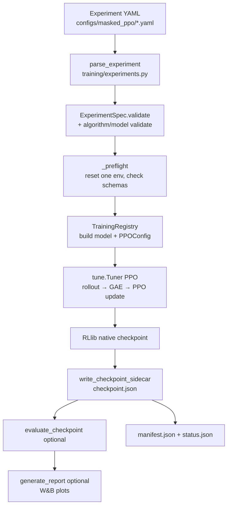
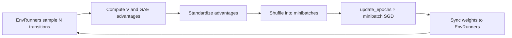
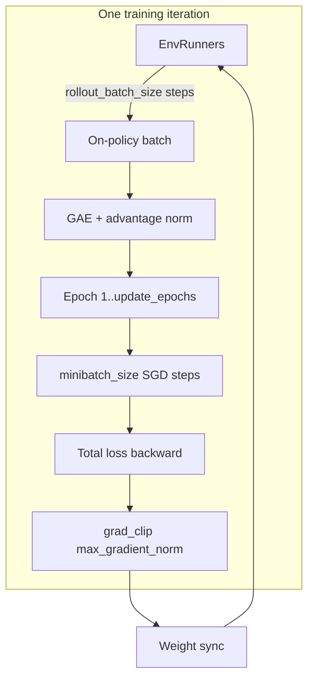
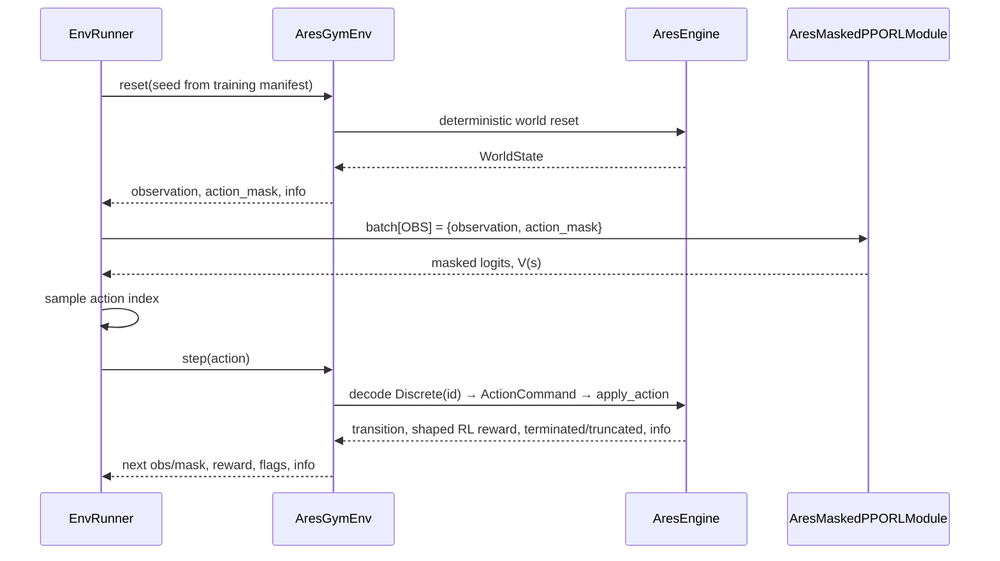
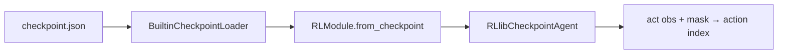

# Masked PPO workflow

Implementation reference for the built-in `masked_ppo` algorithm and `local_cnn_actor_critic` model. Covers data flow, PPO/GAE/losses, the Ray training loop, and checkpoint inference. Simulator rules, rewards, and legality live in `aresim.core` and `aresim.components`; this package wires them into Ray RLlib and PyTorch.

For the broader RL guide (baselines, seeds, scaling, literature), see [RL Algorithms, Training, and Evaluation](../../../../docs/rl/rl_quickstart.md).

**Source ownership**

| File | Responsibility |
|---|---|
| `config.py` | `MaskedPPOConfig`, `ModelConfig`, YAML decode |
| `train.py` | `LocalMaskedActorCritic`, `AresMaskedPPORLModule`, metrics, `run_experiment` |
| `checkpoint.py` | Sidecar JSON, `RLlibCheckpointAgent`, frozen inference |
| `../registry.py` | Registers `masked_ppo`, `local_cnn_actor_critic`, `rllib_masked_ppo` |

---

## End-to-end training flow



**CLI entry:** `aresim-rl train configs/masked_ppo/smoke.yaml`  
**Python entry:** `run_experiment(spec)` in `train.py` (lazy-exported from `aresim.training`).

`run_experiment` writes under `<artifacts.root>/<experiment_id>/<trial_id>/`:

- `resolved_config.yaml` — frozen experiment envelope
- `manifest.json` — provenance, `wandb_run_id`, artifact inventory
- `status.json` — `running` / `completed` / `failed`
- `checkpoints/final/checkpoint.json` — auditable sidecar
- `checkpoints/final/native/` — RLlib module weights
- `evaluation/final/` — post-training rollout summary (when enabled)
- `reports/` — W&B metric plots (online tracking + `report=True`)

---

## Policy input contract

Every training, evaluation, and UI inference path exposes the same Gymnasium dict:

```python
{
    "observation": { ... },   # aresim.obs.local.v1
    "action_mask": int8[10],  # 1 = legal, 0 = illegal
}
```

Built by `policy_input()` in `aresim/envs/environment.py` and wrapped by `AresGymEnv` (`aresim/envs/gymnasium.py`).

| Schema | ID | Producer |
|---|---|---|
| Observation | `aresim.obs.local.v1` | `LocalObservation` in `components/observations.py` |
| Actions | `aresim.action.rover.v1` | `DiscreteActions` in `components/actions.py` |
| Mask | same as actions | `DiscreteActions.mask()` → `validate_action` per index |

The neural network never sees raw `WorldState`, UI snapshots, or privileged global map data.

---

## Observation tensors (`aresim.obs.local.v1`)

Default window size is **8×8** (rover-centered crop). Phase 1 uses **10** discrete actions and **8** objective slots (`max_objectives`).

| Key | Shape | Dtype | Meaning |
|---|---|---|---|
| `terrain_type` | `(8, 8)` | `uint8` | Terrain category ID per cell (0 = padding/out of bounds, 1–7 = regolith…ridge) |
| `spatial` | `(5, 8, 8)` | `float32` | Per-cell channels: height, roughness, ice, ore, dust (each in `[0, 1]`) |
| `cell_flags` | `(4, 8, 8)` | `uint8` | Cell flags; includes scanned/extracted bits |
| `self` | `(10,)` | `float32` | Rover position (normalized), battery, health, cargo fractions, time-of-day sin/cos |
| `colony` | `(14,)` | `float32` | Colony power, water, oxygen, livability, dust, build progress, service flag, … |
| `pad_proximity` | scalar | `int` | `0` far, `1` near build pad, `2` on pad |
| `weather_type` | scalar | `int` | Weather enum ID (1–5) |
| `objective_type` | `(8,)` | `uint8` | Objective type per slot (Phase 1 open exploration often all zero) |
| `objectives` | `(8, 4)` | `float32` | Objective feature rows |
| `objective_mask` | `(8,)` | `uint8` | `1` = active objective slot for pooling |

Terrain IDs and weather IDs are defined in `components/observations.py` (`TERRAIN_IDS`, `WEATHER_IDS`).

---

## Action space (`aresim.action.rover.v1`)

| ID | Action | Notes |
|---|---|---|
| 0 | Wait | Always legal (`mask[0] = 1`) |
| 1 | Move north | Target cell from rover position |
| 2 | Move east | |
| 3 | Move south | |
| 4 | Move west | |
| 5 | Scan | At current cell |
| 6 | Extract | At current cell |
| 7 | Build | At current cell |
| 8 | Service | At current cell |
| 9 | Unload | At current cell |

Legality is computed by the environment from `aresim.core.rules.validate_action`. The policy head outputs **10 logits**; illegal indices are masked to `finfo.min` before sampling or argmax.

---

## Model: `LocalMaskedActorCritic`

Class: `train.py` → `LocalMaskedActorCritic`  
RLlib wrapper: `AresMaskedPPORLModule` (implements `ValueFunctionAPI`)

### Processing pipeline

```mermaid
flowchart TB
    subgraph spatial_branch [Spatial branch]
        T[terrain_type 8x8] --> TE[Embedding 8 → terrain_embedding]
        TE --> CAT1[Concat with spatial 5x8x8 + cell_flags 4x8x8]
        S[spatial + flags] --> CAT1
        CAT1 --> C1[Conv2d 3x3 → conv_channels[0], tanh]
        C1 --> C2[Conv2d 3x3 → conv_channels[1], tanh]
        C2 --> FLAT[Flatten → conv_channels[1] * 8 * 8]
    end

    subgraph telemetry_branch [Telemetry branch]
        SV[self 10] --> TJ[Concat]
        CV[colony 14] --> TJ
        P[pad_proximity] --> PE[Embedding 3 → 4]
        PE --> TJ
        W[weather_type] --> WE[Embedding 6 → 4]
        WE --> TJ
        OT[objective_type] --> OE[Embedding 9 → objective_embedding]
        OE --> OR[Concat with objectives 8x4]
        OBJ[objectives + mask] --> OP[Linear encoder → masked mean pool → 32]
        OP --> TJ
        TJ --> T1[Linear → telemetry_layers[0], tanh]
        T1 --> T2[Linear → telemetry_layers[1], tanh]
    end

    FLAT --> FUSE[Linear → fused_width, tanh]
    T2 --> FUSE
    FUSE --> POL[Linear → 10 logits]
    FUSE --> VAL[Linear → 1 value]
    M[action_mask 10] --> MASK[masked_fill illegal logits]
    POL --> MASK
```

Default `ModelConfig` (from `config.py` / YAML `model_config`):

| Field | Default | Role |
|---|---|---|
| `terrain_embedding` | 4 | Terrain category embedding width |
| `objective_embedding` | 4 | Objective type embedding width |
| `conv_channels` | `(32, 64)` | Spatial CNN widths |
| `telemetry_layers` | `(128, 128)` | Telemetry MLP hidden sizes |
| `fused_width` | 256 | Shared trunk before policy/value heads |

**Telemetry input width** (fixed by observation layout): `10 + 14 + 4 + 4 + 32 = 64` → MLP → `telemetry_layers[1]`.

**Spatial input channels** after terrain embed: `terrain_embedding + 5 + 4` (default `4 + 5 + 4 = 13`).

### Forward outputs

| Output | Shape | Use |
|---|---|---|
| Masked logits | `(batch, 10)` | RLlib categorical policy; checkpoint argmax/sample |
| Value | `(batch,)` | GAE / advantage computation via `compute_values` |

`forward`, `_forward_inference`, `_forward_exploration`, and `_forward_train` all call the same core path so training and rollout policies stay aligned.

---

## RLlib integration

| Layer | Class / symbol | Role |
|---|---|---|
| Registered env | `ENV_NAME = "aresim_gym_rllib_v1"` | Factory `_environment()` builds `AresGymEnv` inside `_SeededTrainingEnv` |
| Seed cycling | `_SeededTrainingEnv` | Cycles fixed training seeds from the evaluation seed manifest’s `train` split |
| Algorithm config | `MaskedPPOFactory.build()` | Returns configured `PPOConfig` |
| RLModule | `AresMaskedPPORLModule` | Torch module registered via `RLModuleSpec` |
| Callbacks | `AresMetricsCallback` | Per-step env diagnostics + canonical W&B metric names |

Worker seed offset (deterministic parallel diversity):

```
offset = learner_seed * 104729 + worker_index * 1009 + vector_index * 9176
```

PPO hyperparameters map from `MaskedPPOConfig` → `PPOConfig.training(...)` in `MaskedPPOFactory.build()`.

---

## PPO hyperparameters (`MaskedPPOConfig`)

| Field | Default | RLlib / PPO mapping |
|---|---|---|
| `total_environment_steps` | 4096 | Tune stop: `iterations = total // rollout_batch_size` |
| `rollout_batch_size` | 4096 | `train_batch_size_per_learner` |
| `minibatch_size` | 256 | `minibatch_size` (must divide rollout batch) |
| `update_epochs` | 10 | `num_epochs` |
| `gamma` | 0.99 | `gamma` |
| `gae_lambda` | 0.95 | `lambda_` |
| `clip_param` | 0.2 | `clip_param` |
| `value_loss_coefficient` | 0.5 | `vf_loss_coeff` |
| `entropy_coefficient` | 0.01 | `entropy_coeff` |
| `learning_rate` | 3e-4 | `lr` |
| `max_gradient_norm` | 0.5 | `grad_clip` |
| `target_kl` | 0.01 | `kl_target` |

Schedules in the parent `ExperimentSpec` (`evaluation.interval_environment_steps`, `checkpoint.interval_environment_steps`) must also be divisible by `rollout_batch_size`.

---

## Proximal Policy Optimization (algorithm)

AresSim implements **on-policy clipped PPO** through Ray RLlib’s `PPO` trainable. The actor-critic network (`LocalMaskedActorCritic`) outputs masked categorical logits and a scalar value \(V(s)\). RLlib owns sampling, GAE, loss assembly, backprop, and optimizer steps; this package owns the environment contract, masking, reward projection, and metric names.

### On-policy update cycle

PPO never trains on stale replay data. Each learner iteration:

1. **Sample** — EnvRunners collect fresh transitions with the *current* policy (stochastic sampling over legal actions).
2. **Estimate** — Values and GAE advantages are computed from the shaped RL rewards in the batch.
3. **Optimize** — The same batch is shuffled into minibatches and reused for `update_epochs` passes.
4. **Sync** — Updated weights are pushed back to EnvRunners.
5. **Discard** — The batch is thrown away; the next iteration samples new experience.



**References:** [Schulman et al., PPO (2017)](https://arxiv.org/abs/1707.06347); [Schulman et al., GAE (2015)](https://arxiv.org/abs/1506.02438); [Huang & Ontañón, invalid-action masking (2020)](https://arxiv.org/abs/2006.14171).

### Generalized Advantage Estimation (GAE)

For each sampled transition \(t\), RLlib forms a one-step TD residual using the **shaped RL reward** returned by `AresGymEnv` (not the engine/UI reward):

```text
δ_t = r_t + γ · bootstrap_t · V(s_{t+1}) - V(s_t)
```

- `bootstrap_t = 0` when the transition is **terminated** (authoritative simulator failure).
- `bootstrap_t = 1` on non-terminal steps, including **truncated** steps at `max_episode_steps=1200` (external cutoff; value bootstraps from the final observation).

GAE accumulates future residuals with `gae_lambda` (YAML `gae_lambda`, default `0.95`):

```text
Â_t = δ_t + (γλ)δ_{t+1} + (γλ)²δ_{t+2} + …
```

RLlib **standardizes** advantages across the train batch before the policy loss (mean/variance normalization inside the learner).

### Clipped policy surrogate

Let \(\pi_\theta\) be the current policy and \(\pi_{\theta_{\text{old}}}\) the behavior policy that sampled the batch. For discrete actions, the probability ratio is:

```text
ρ_t = π_θ(a_t | s_t) / π_{θ_old}(a_t | s_t)
```

PPO maximizes the pessimistic clipped objective (per transition, before aggregation):

```text
L^CLIP_t = min( ρ_t · Â_t,  clip(ρ_t, 1 - ε, 1 + ε) · Â_t )
```

with `ε = clip_param` (default `0.2`). The **policy loss** logged to W&B is the negative of this surrogate (plus any RLlib-specific aggregation). High `learner/clip_fraction` means many ratios hit the clip boundary — the update is actively limiting policy change.

### Action masking and PPO

Masking is applied **inside** `LocalMaskedActorCritic` before softmax:

```text
masked_logit[a] = raw_logit[a]           if action_mask[a] == 1
masked_logit[a] = minimum_finite_float   if action_mask[a] == 0
```

Illegal actions therefore have ~zero probability in **both** the sampling distribution (EnvRunner) and the learner’s forward pass. Stored behavior log-probabilities and updated log-probabilities always refer to the same masked categorical distribution. `AresMetricsCallback` logs `ares/mask_violations` when a sampled index was illegal against the previous mask (should stay near zero).

---

## Training procedure

### Terminology

| Term | Meaning in this pipeline |
|---|---|
| **Transition** | One `(observation, mask, action, shaped_reward, flags, next_observation)` step |
| **Episode** | Transitions from reset until `terminated` or `truncated` |
| **Episode fragment** | Contiguous slice of an episode collected for batching; may end mid-episode |
| **Training iteration** | One full PPO cycle: collect `rollout_batch_size` env steps → GAE → `update_epochs` of SGD |
| **Train batch** | Fresh on-policy transitions consumed by one iteration (not stored in a replay buffer) |
| **Minibatch** | `minibatch_size` transitions per optimizer step inside an iteration |
| **Recorded trajectory** | `TrajectoryWriter` artifact from evaluation; **not** used for PPO training |

### Ray Tune driver (`run_experiment` → `_fit`)

`run_experiment` in `train.py` prepares the run directory, authenticates W&B, then calls `_fit`:

```python
iterations = max(1, total_environment_steps // rollout_batch_size)
stop = {"training_iteration": iterations}
```

Example (`smoke.yaml`): `102_400 / 4_096 = 25` training iterations.

Each iteration EnvRunners collect until the learner receives **`rollout_batch_size` environment steps** (`train_batch_size_per_learner` in `MaskedPPOFactory.build()`). With default sizes:

| Quantity | Default | Formula |
|---|---:|---|
| Env steps per iteration | 4,096 | `rollout_batch_size` |
| Minibatches per epoch | 16 | `rollout_batch_size / minibatch_size` |
| Optimizer steps per iteration | 160 | `(rollout_batch_size / minibatch_size) × update_epochs` |
| Total env steps (smoke) | 102,400 | `25 × 4,096` |
| Total env steps (reference) | 1,048,576 | `256 × 4,096` |

### EnvRunner configuration

`MaskedPPOFactory.build()` sets:

| `PPOConfig` call | Value | Effect |
|---|---|---|
| `.env_runners(...)` | `num_env_runners`, `num_envs_per_env_runner`, `cpus_per_env_runner` | Parallel actors + vectorization |
| `rollout_fragment_length` | `"auto"` | RLlib picks fragment sizes that fill the train batch |
| `batch_mode` | `"truncate_episodes"` | Fragments may split mid-episode; env is **not** reset at fragment boundary |
| `.learners(...)` | `num_learners`, `gpus_per_learner` | Learner scaling (0 learners = local driver learner) |
| `.framework("torch")` | PyTorch | Matches `LocalMaskedActorCritic` |
| `.debugging(seed=learner_seed)` | fixed seed | Reproducible weight init / sampling where RLlib applies it |

Training environments are wrapped in `_SeededTrainingEnv`, which cycles **training seeds** from the evaluation seed manifest’s `train` split (not validation/test). Offset formula:

```text
offset = learner_seed × 104729 + worker_index × 1009 + vector_index × 9176
```

### Checkpoint and mid-training evaluation

During `_fit`, Ray Tune checkpoints on:

```text
checkpoint_frequency = max(1, checkpoint.interval_environment_steps // rollout_batch_size)
```

Each Ray checkpoint triggers `AresCheckpointExportCallback`, which copies native RLlib state and writes a UI-loadable sidecar under:

```text
checkpoints/step_<environment_steps>/checkpoint.json
```

Example: `checkpoints/step_081920/checkpoint.json` after 81,920 environment steps. The callback keeps the newest `checkpoint.keep` `step_*` exports; `checkpoints/final/` is still written when training completes.

Post-training (`_finish_run`, when `evaluate=True`), `evaluate_checkpoint` runs on the **validation** (or configured) split and optionally logs scalars to W&B. Neither path mutates simulator rules.

### Termination vs truncation (bootstrap semantics)

| Flag | Meaning | GAE bootstrap |
|---|---|---|
| `terminated=True` | Battery, rover health, or colony livability failure | `V(s_{t+1})` not used (`bootstrap=0`) |
| `truncated=True` | `max_episode_steps` cutoff only | Bootstrap from final `V(s_{t+1})` |
| Both possible | Authoritative termination wins | Same as terminated |

### What is **not** saved for training

PPO is on-policy: EnvRunner fragments are temporary learner input. AresSim does **not** mirror them into `TrajectoryWriter`, JSONL logs, or the UI. Offline datasets and `aresim.trajectory.v1` exports are evaluation/baseline concerns (`training/runner.py`, `training/evaluation.py`).



---

## Losses and optimization

RLlib’s PPO learner combines several terms each minibatch. AresSim surfaces the aggregates through `canonicalize_rllib_metrics()` as stable W&B names.

### Combined objective (conceptual)

```text
L_total = -L^CLIP + c_v · L^VF - c_e · H(π_θ) + KL_penalty
```

| Symbol | Config field | Default | W&B metric | Role |
|---|---|---:|---|---|
| `L^CLIP` | `clip_param` | 0.2 | `learner/policy_loss` | Clipped surrogate (policy improvement) |
| `L^VF` | `value_loss_coefficient` | 0.5 | `learner/value_loss` | Critic fit to GAE returns / value targets |
| `H(π_θ)` | `entropy_coefficient` | 0.01 | `learner/entropy` | Encourages spread among **legal** actions |
| `KL_penalty` | `target_kl` | 0.01 | `learner/approx_kl` | Adaptive KL control when update is too large |
| — | — | — | `learner/total_loss` | Scalar RLlib reports after combining terms |
| — | `max_gradient_norm` | 0.5 | `learner/gradient_norm` | Global norm clip before optimizer step |
| — | — | — | `learner/clip_fraction` | Fraction of ratios clipped this iteration |
| — | — | — | `learner/explained_variance` | How well `V(s)` explains returns |
| — | `learning_rate` | 3e-4 | `learner/learning_rate` | Adam step size |

**Value loss** trains the shared trunk’s value head to predict returns consistent with the GAE targets computed from shaped rewards. **Entropy** is computed on the masked categorical distribution — only legal actions receive probability mass, so entropy measures exploration *within* the current mask.

**KL target** (`kl_target` in RLlib) throttles updates when the new policy diverges too far from the behavior policy; watch `learner/approx_kl` alongside `clip_fraction` when tuning stability.

### Optimizer flow per minibatch

1. Forward `AresMaskedPPORLModule` on minibatch observations (with masks).
2. Recompute log-probabilities and values for stored actions.
3. Evaluate clipped surrogate, value loss, entropy, KL.
4. Backpropagate `L_total`.
5. Clip gradients to `max_gradient_norm`.
6. Adam step at `learning_rate`.

After all epochs complete, EnvRunner inference modules receive the updated weights.

---

## Learning reward (`shaped_train`)

PPO optimizes **`aresim.reward.shaped_train.v1`** (`components/rewards.py`), selected by `environment.reward: shaped_train` in experiment YAML. The engine/UI reward is still returned in `info` for auditing but is **not** the RLlib training signal.

Each step, `_raw_values` measures deltas from the transition; terms are multiplied by configured weights:

| Term | Weight | Triggers when |
|---|---:|---|
| `mission_success` | +10 | Task success (inactive in open exploration) |
| `terminal_failure` | −5 | Authoritative episode failure |
| `objective_progress` | +2 | Task objective delta (inactive in open exploration) |
| `new_scan` | +0.10 | `terrain_scanned` increases |
| `ice_delivered` | +0.50 | Ice delivered / payload capacity |
| `samples_delivered` | +0.20 | Samples delivered / capacity |
| `build_progress` | +0.50 | Habitat build progress increases |
| `service_recovery` | +0.25 | SERVICE action improves health or reduces dust |
| `hazard_damage` | −1.00 | Rover health decreases |
| `energy_used` | −0.05 | Colony battery decreases |
| `invalid_action` | −0.10 | Effective action is INVALID |
| `time_cost` | −0.001 | Every non-terminal step |

Non-terminal totals are clipped to **`[-2, 2]`** before being returned as the Gymnasium reward. Terminal success/failure terms are not clipped. Sparse evaluation (`sparse_eval`) zeros most shaping terms and is used for frozen checkpoint comparison, not online PPO training.

Because `build_progress` and `service_recovery` are easy to trigger on the landing pad, short smoke runs can converge to **pad-local policies** that rarely move. Longer training (`reference.yaml`) and exploration-favoring reward balance are needed for movement-heavy behavior.

---


One RLlib step through `AresGymEnv`:



**`info` fields used for metrics** (via `AresMetricsCallback`):

- `effective_action` — action counts, invalid-action detection
- `engine_reward` — raw engine return component
- `reward_breakdown` — per-term shaped reward logging

Mask violations are detected by comparing the sampled action to the **previous** step’s mask.

---

## W&B metrics

Stable names are injected in `canonicalize_rllib_metrics()` before Ray’s logger runs.

| W&B name | Source |
|---|---|
| `train/environment_steps` | RLlib lifetime env steps |
| `train/shaped_return` | Mean episode return |
| `train/episode_length` | Mean episode length |
| `learner/total_loss`, `policy_loss`, `value_loss` | Learner diagnostics |
| `learner/entropy`, `approx_kl`, `explained_variance` | PPO health |
| `train/invalid_actions`, `train/mask_violations` | From `ares/*` env-runner metrics |
| `train/telemetry/*` | Battery, health, colony resources (step means) |
| `evaluation/*` | Post-training `summary.json` scalars |

W&B run id is a fresh 24-character hex string per training invocation (`manifest.json` → `wandb_run_id`); `config_hash` remains separate for reproducibility.

---

## Checkpoint and inference

Training exports:

1. **Mid-training** — `checkpoints/step_<environment_steps>/checkpoint.json` plus `native/` (written on each Ray Tune checkpoint; UI-loadable while training continues)
2. **Final** — `checkpoints/final/checkpoint.json` plus `native/` (promoted copy when training completes)

Both use sidecar schema `aresim.checkpoint.rllib.v1` with provenance (`config_hash`, schema IDs, experiment envelope) and SHA-256 inventory of native files.

**Inference path:**



`RLlibCheckpointAgent` (`checkpoint.py`):

- Builds `{Columns.OBS: {observation, action_mask}}` tensors
- Calls `module.forward_inference`
- **Deterministic:** `argmax` on masked logits (evaluation default)
- **Stochastic:** `multinomial(softmax(logits))` with per-episode `reset(seed)`

Public loader: `make_checkpoint_agent(path)` via `TrainingRegistry`.

---

## What this package does not own

| Concern | Owner |
|---|---|
| World generation, rules, rewards | `aresim.core`, `aresim.components` |
| Experiment YAML envelope | `aresim.training.experiments` |
| Fixed-seed evaluation rollouts | `aresim.training.evaluation` |
| Trajectory recording (`aresim.trajectory.v1`) | `aresim.training.trajectories` |
| UI policy bridge | `aresim.integrations.policy` |

Keep new learned algorithms parallel to this layout: typed config, RLModule, factory, checkpoint loader, and registry entries under new semantic names.
